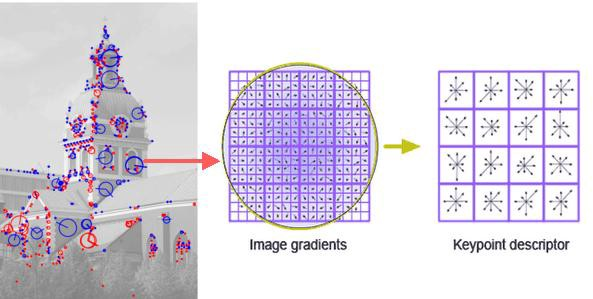
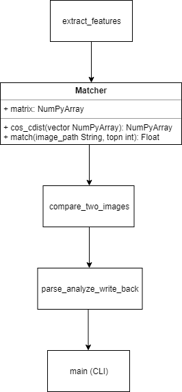

# Compare Pairs of Images Project

This project was developed to allow for ease of two-image comparison from a csv of pairs of image paths. The image comparison generates a similarity score that is stored in the output csv along with the time taken to gather the similarity score. The elapse time is given in seconds.

For example: 

 Input CSV - 
 image1,image2 
 aa.png,ba.png 
 ab.png,bb.png 
 ac.png,bc.png 
 ad.png,bd.png

 Output CSV - 
 image1,image,similar,elapsed 
 aa.png,ba.png,0,0.006 
 ab.png,bb.png,0.23,0.843 
 ac.png,bc.png,0,1.43 
 ad.png,bd.png,1,2.32

## Setup Instructions

### Windows:

1) Install Python 3.7.3 by downloading and running the executable from here: https://www.python.org/downloads/release/python-373/
2) Install Latest Pip. Open Powershell and run the following command: `py -m pip install --upgrade pip`
3) Run the following in Powershell: `py -m pip install numpy scipy Pillow imageio opencv-python==3.4.2.17 opencv-contrib-python==3.4.2.17`
4) Install git (https://git-scm.com/download/win) and clone the repository by running the following in Powershell: `git clone https://github.com/ssajnani/CompareImages.git`
5) To execute the image comparison, change directories to the root directory of this project. To get a command line description of program usage run `py main.py`. Otherwise, run the python script as follows, `py main.py {path_to_input_csv_file}` , the output will be in the root directory in a file called output.csv. If you would like to provide a path for the output csv file you can execute the script like this, `py main.py {path_to_input_csv_file} {path_to_output_csv_file}`

### MacOS:

1) Install Python 3.7.3 by downloading and running the executable from here: https://www.python.org/downloads/release/python-373/
2) Install Latest Pip. Open Terminal and run the following command: `python3 -m pip install --user --upgrade pip`
3) Run the following in Terminal: `pip3 install numpy scipy Pillow imageio opencv-python==3.4.2.17 opencv-contrib-python==3.4.2.17`
4) Install git (https://git-scm.com/download/mac) and clone the git repository by running the following in Terminal: `git clone https://github.com/ssajnani/CompareImages.git`
5) To execute the image comparison, in Terminal, change directories to the root directory of this project. To get a command line description of program usage run `py main.py`. Otherwise, run the python script as follows, `python3 main.py {path_to_input_csv_file}`, the output will be in the root directory in a file called output.csv. If you would like to provide a path for the output csv file you can execute the script like this, `python3 main.py {path_to_input_csv_file} {path_to_output_csv_file}`

## Approach

1) Selected Python because it's one of the more modern and approachable languages when it comes to computer vision and image analysis.
2) Looked into the different types of image comparison. Found a stack overflow post that explained the difference between histogram comparison, template matching and feature matching. Feature matching seems to be more efficient because image comparison can be carried out invariant to transformations. Source: https://stackoverflow.com/questions/11541154/checking-images-for-similarity-with-opencv 
3) Searched for feature matching image comparison using Python and found a Medium article describing a program that uses batch iamge feature extraction and compares one image to a set of images. The feature matching technique used is the KAZE feature matching algorithm. Used this as a base to begin the project and remove the batch feature extraction to compare images on a one-to-one basis. Source: https://medium.com/machine-learning-world/feature-extraction-and-similar-image-search-with-opencv-for-newbies-3c59796bf774
4) Researched feature matching algorithms other than KAZE, and found a research paper outlining the most useful feature matching algorithms. The two most popular and effective algorithms used are Speeded Up Robust Features (SURF) and Scale-Invariant Feature Transform (SIFT), because of their invariance to scale, rotate, translation, illumination, and blur. SURF is better than SIFT in rotation invariant, blur and warp transform. SURF is 3 times faster as such a compromise of speed was made by choosing SURF as the feature extraction algorithm of choice. Source:  https://www.researchgate.net/publication/314285930_Comparison_of_Feature_Detection_and_Matching_Approaches_SIFT_and_SURF

SURF gathers features based on gradients and the defining gradients of the image are collected as key points as described in the diagram below:

5) One class and four python module files were created. 
>>  * The most critical module was the **feature_extractor** which has a function extract_features that generates a numpy array of extracted features gathered from an image file using the SURF algorithm. 
>>  * The **Matcher** class can be used to instantiate an object with an image and its feature vector using the **feature_extractor** module. Once instantiated, the Matcher can then be used to perform a match operation on the object's self vector with the features of another image provided. The match operation is a comparison of cosine distance or distance between the points in the image vectors.
>>  * The **compare** module has a function called compare_two_images that is used to initialize a **Matcher** object with an image and perform a match against another image, returning the cosine distance as a similarity value. 
>>  * The **parse_analyze** module has a function called parse_analyze_write_back that reads in an input csv row by row takes the two values in each row and performs a compare operation using the **compare** module, the elapsed time for comparison is recorded, the output is written in an output csv. It is important to note that the output csv is updated row by row so if the input csv is N values large, the user can expect the output to be output incrementally over time, instead of at the end of the processing. 
>>  * This **parse_analyze** function is the called in the **main** module which acts as the command line argument parser for the program.  

The above design choices are summarized in the diagram below:

## Project Considerations
1) The code is unit tested and integration tested, also the Gitlab CI/CD pipeline is used to verify this.
2) The program has a simple interface based on passing a command line argument to python. The setup is required to have python on your local machine. Both MacOS and Windows have been tested to ensure ease of usage by Bjorn.
3) To help Ferris, the future maintainer, there are a list of things I have done to ensure he succeeeds:
* Created a CI/CD pipeline to screen pull requests with various unit tests
* Create templates for pull requests and issues so it's easier to work with those github features
* Add branch protection rules to prevent merging without approval from the team
* Status checks in Pull Requests ensure that tests are passing in order for a merge
* Create issues to follow the current features to be implemented or bugs to be tracked (once the project is bigger use JIRA boards)
* Provide documentation and research background on how this project was implemented
* Add comments to code for understanding, comments can be parsed because they are created as docstring
* Tagging releases and maintaining latest release branches to keep track of changes between major product changes
4) Each release is tagged and each tag has a branch associated with it, thus, Bjorn can get the latest version by looking at the tags. To get versions in between release Bjorn can simply clone the production branch

